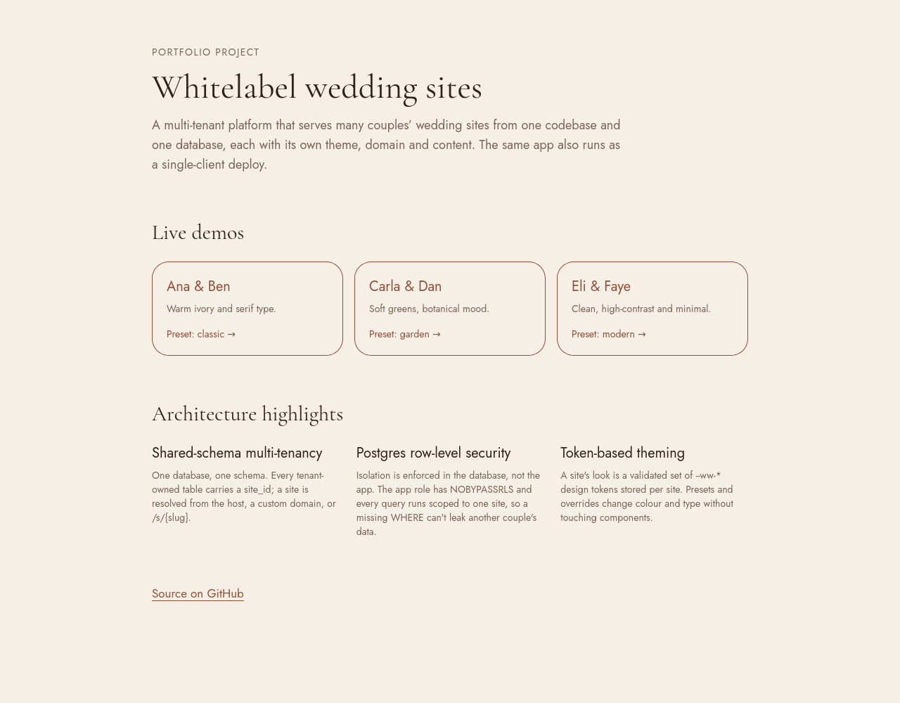
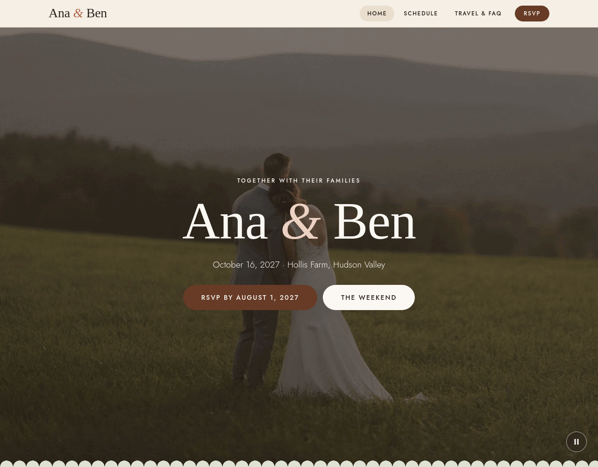
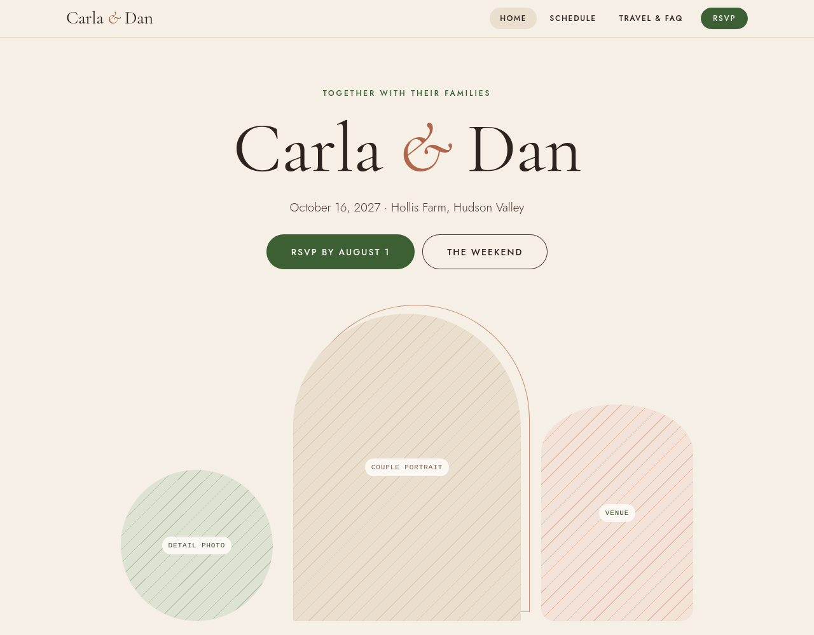
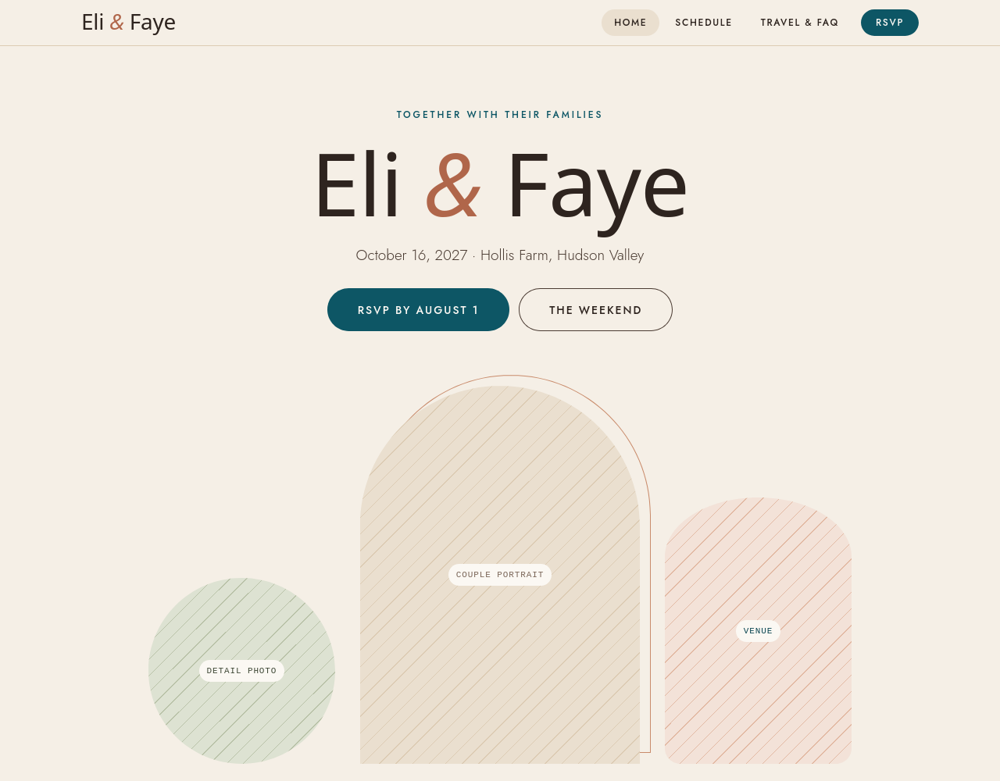
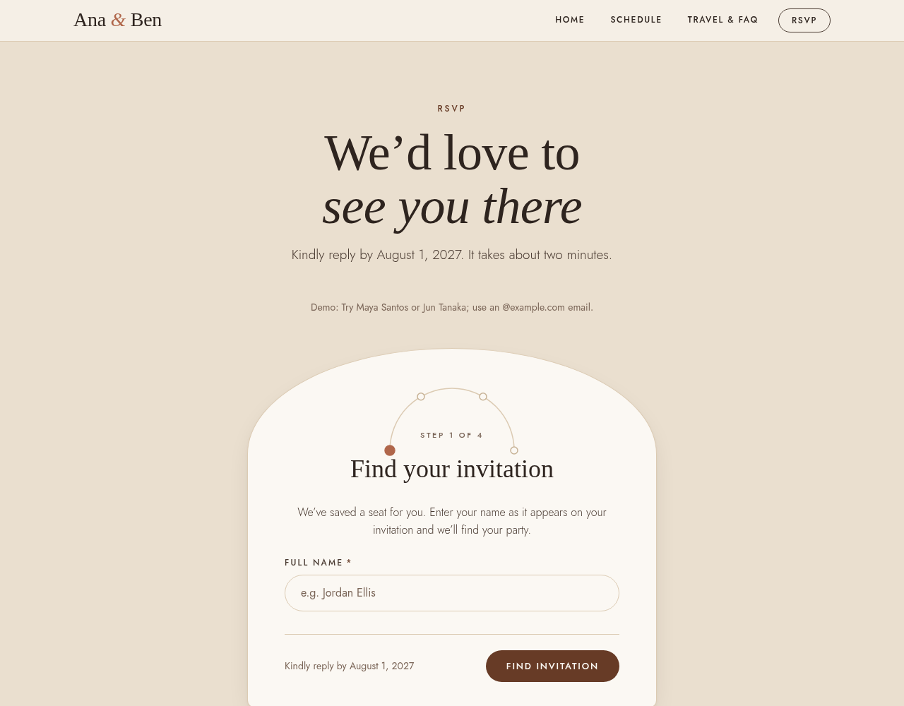
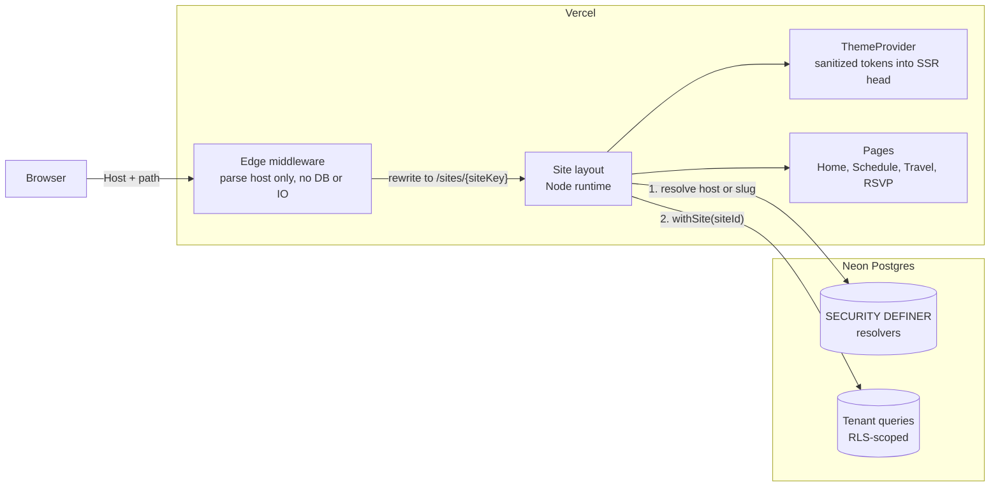

# Whitelabel wedding sites

A multi-tenant platform that serves many couples' wedding sites from **one codebase and one
database**. Each site has its own theme, domain and content, and isolation between couples is
enforced by Postgres, not by application code. The same app also runs as a single-client deploy.

**Live demo: <https://wedding-website-gamma-teal-87.vercel.app>**

| Demo                                                                            | Preset    |
| ------------------------------------------------------------------------------- | --------- |
| [Ana & Ben](https://wedding-website-gamma-teal-87.vercel.app/s/ana-and-ben)     | `classic` |
| [Carla & Dan](https://wedding-website-gamma-teal-87.vercel.app/s/carla-and-dan) | `garden`  |
| [Eli & Faye](https://wedding-website-gamma-teal-87.vercel.app/s/eli-and-faye)   | `modern`  |

The three demos are the same components with different per-site theme tokens.



|                                                          |                                                          |                                                         |
| -------------------------------------------------------- | -------------------------------------------------------- | ------------------------------------------------------- |
|  |  |  |

This is a portfolio project on free tiers (Vercel Hobby + Neon). The homepage serves Ana & Ben
(`DEFAULT_SITE_SLUG=ana-and-ben`); the three demos stay at `/s/{slug}`. Subdomain and
custom-domain routing is implemented and tested, and only needs a domain to go live.

### Try the RSVP

RSVP runs end to end on **fake, seeded guests** under RLS. Open
[/rsvp](https://wedding-website-gamma-teal-87.vercel.app/rsvp), look up **Maya Santos** or
**Jun Tanaka** (his party has a plus-one), answer for each guest, and enter an `@example.com`
email. Real addresses are rejected by design.



The demo is publicly writable: anyone can overwrite a demo reply, which is acceptable because
every guest is fake and no real data is collected. There is no rate limit or invite code yet
(planned for the Guest + RSVP sprint). Replies are reset by reseeding by hand, at least weekly
(`ALLOW_DEMO_SEED=1 pnpm --filter @ww/db seed:rsvp`; see [docs/demo-script.md](docs/demo-script.md)).

## Architecture



A request flows like this:

1. **Middleware** maps host and path to a site key (`s.{slug}` or `h.{hostname}`) and rewrites to
   an internal route. It reads nothing but the request.
2. The **site layout** resolves that key to a site id through narrow `SECURITY DEFINER` functions
   that expose only `id` and `slug`.
3. Everything else runs inside `withSite(siteId, …)`, a transaction that sets `app.site_id`. RLS
   policies compare every row's `site_id` against it.
4. The layout loads the site's theme and `ThemeProvider` writes the validated tokens into the
   server-rendered `<head>`. There is no flash of unstyled content and no client JS for theming.

Host precedence: `SINGLE_TENANT_SLUG` pin, then custom domain, then `{slug}.ROOT_DOMAIN`, then
`/s/{slug}` on the platform host.

## Key decisions

### Shared-schema tenancy with row-level security

Every tenant-owned table carries `site_id`, and RLS is `ENABLE`d and `FORCE`d on all of them.
Schema-per-tenant or database-per-tenant would isolate harder, but cost a migration run per
tenant and a connection-routing layer, which is too much for a product with thousands of small
sites. Shared schema keeps one migration path and one connection pool.

The risk is that one forgotten `WHERE site_id = …` leaks another couple's data, so isolation lives
in the database instead:

- The app connects as a **non-owner login role** (`NOBYPASSRLS`). Neon's owner role bypasses RLS,
  so it is used only for migrations and seeding, from a laptop, and is never set in Vercel.
- Tenant context is a transaction-local setting, so it can't outlive the transaction and pooled
  connections stay safe. No context means zero rows.
- A test suite asserts the exact privilege matrix and tries cross-tenant reads and writes. It
  runs on PGlite in CI and live against a Neon branch (64 tests, 54 of them in CI).

Details: [packages/db](packages/db/README.md).

### The edge middleware does no database calls

Middleware runs on every request, globally, before the cache. A database lookup there would add
latency to every page and every static asset, and couple availability of the whole site to one
region's database. So middleware is a pure function of `(host, path)`: it picks a site key and
rewrites. The database lookup happens once in the Node-runtime layout, where the result is cached
(`unstable_cache`, 300s ISR). Because the function is pure, the entire routing table is covered
by unit tests with no mocks.

### The theming token contract

A site's look is data, not code. `@ww/ui` defines a fixed contract of **18 CSS variables**
(`--ww-color-primary`, `--ww-font-heading`, `--ww-radius`, …): 8 surface tokens that flip between
light and dark, and 10 brand tokens. Components use only these, via a Tailwind v4 preset.

- A site picks a **preset** (`default`, `classic`, `garden`, `modern`) and may add per-site
  **overrides** stored as JSON in `site_theme.tokens`.
- Overrides pass an allow-list validator before they reach the page. It permits color functions,
  `color-mix`, `var`, and `calc`-family math, and rejects `url()`, `;{}<>\@!:` and comments. A
  tenant-controlled value is therefore never an injection vector.
- A test fails if the token CSS or Tailwind preset drift from the canonical token list.

This is what lets a designer's output drop in: satisfy the contract and everything else keeps
working. Details: [packages/ui](packages/ui/README.md).

## Packages

| Package                                             | Role                                                                                                        |
| --------------------------------------------------- | ----------------------------------------------------------------------------------------------------------- |
| [`apps/web`](apps/web) (`@ww/web`)                  | Next.js 15 app: edge middleware, host-to-site routing, themed public pages, landing page, metadata          |
| [`packages/db`](packages/db) (`@ww/db`)             | Drizzle schema, Neon clients, RLS migrations, `withSite()`, host/slug resolvers, demo seed, isolation tests |
| [`packages/ui`](packages/ui) (`@ww/ui`)             | Token contract, Tailwind v4 preset, server-rendered `ThemeProvider`, Arc & Hearth components                |
| [`packages/env`](packages/env) (`@ww/env`)          | `createEnv`: zod-validated, fail-fast environment loading                                                   |
| [`packages/config`](packages/config) (`@ww/config`) | Shared tsconfig, ESLint flat config and Prettier config                                                     |

Stack: Next.js 15, React 19, Tailwind v4, Drizzle, Neon Postgres, Vitest, pnpm + Turborepo.

## Run it locally

Requirements: Node 22 (`nvm use`), pnpm 10 (`corepack enable`), and a free
[Neon](https://neon.tech) project.

```sh
pnpm install
pnpm lint && pnpm typecheck && pnpm test   # the isolation suite runs on PGlite, no database needed
```

To run the app, set up a database once. The full walkthrough, including why the app role must
be created in SQL and its password set in the Neon Console, is in
[packages/db/README.md](packages/db/README.md#neon-setup-once-per-project).

```sh
cp packages/db/.env.example packages/db/.env      # set MIGRATE_DATABASE_URL (owner, direct host)
pnpm --filter @ww/db db:migrate
# create the ww_app_login role and set its password in the Console (see packages/db/README.md)
ALLOW_DEMO_SEED=1 pnpm --filter @ww/db db:seed    # three demo sites

cp apps/web/.env.example apps/web/.env.local      # set DATABASE_URL (app role, pooled host)
pnpm --filter @ww/web dev
```

Open <http://localhost:3000>, or a demo directly at <http://localhost:3000/s/ana-and-ben>.
Set `SHOWCASE_MODE=1` for the demo banner, `DEFAULT_SITE_SLUG=ana-and-ben` to serve one couple's
site at `/` (the other sites stay at `/s/{slug}`), or `SINGLE_TENANT_SLUG=ana-and-ben` to pin the
app to one site on any host. For RSVP, also run `pnpm --filter @ww/db seed:rsvp` (needs `ALLOW_DEMO_SEED=1`).

## More

- [infra/README.md](infra/README.md): topology, environment matrix, Vercel and Neon setup
- [docs/runbook.md](docs/runbook.md): deploy, rollback, migrations, domains
- [TASKS.md](TASKS.md) and [CHANGELOG.md](CHANGELOG.md): planning ledger and release history

## License

[MIT](LICENSE) © 2026 Alessandro Cruz
